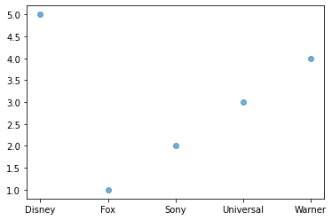
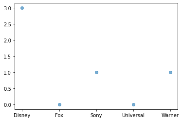

## *Python* HomeWork

#### What Cover


```python
import numpy as np
```


```python
TopMovies = np.loadtxt("E:\Desktop\EBAC_course\Python Self Learning\Homework Instructions\Movies.csv",delimiter=',', dtype=str)
TopMovies
np.shape(TopMovies)
TopMovies
```


    array([['Film', 'Studio', 'TopGross', 'OpenQuarter'],
           ['The Last Jedi', 'Disney', '620', '4'],
           ['Beauty and the Beast', 'Disney', '504', '1'],
           ['Wonder Woman', 'Warner', '413', '2'],
           ['Jumanji', 'Sony', '405', '4'],
           ['Guardians of the Galaxy', 'Disney', '390', '2'],
           ['Spider-Man', 'Sony', '334', '3'],
           ['It', 'Warner', '328', '3'],
           ['Thor: Ragnarok', 'Disney', '315', '4'],
           ['Despicable Me 3', 'Universal', '265', '2'],
           ['Justice League', 'Warner', '229', '4'],
           ['Logan', 'Fox', '226', '1'],
           ['The Fate of the Furious', 'Universal', '226', '2'],
           ['Coco', 'Disney', '210', '4'],
           ['Dunkirk', 'Warner', '188', '3'],
           ['Get Out', 'Universal', '176', '1']], dtype='<U23')

<!--check-->

> - [ ] *`check`*

> ##### a. Create four vectors: Film, Studio, TopGross, OpenQuarter
>


```python
vector = TopMovies[0]
vector
print(vector)
```

    ['Film' 'Studio' 'TopGross' 'OpenQuarter']


##### b. Create a dataframe TopMovies (which includes the four vectors) ; strings should not be encoded as factor


```python
import pandas as pd
TopMovies = pd.DataFrame(np.delete(TopMovies,0,axis=0),columns=vector)
TopMovies
```


<div>
<style scoped>
    .dataframe tbody tr th:only-of-type {
        vertical-align: middle;
    }

    .dataframe tbody tr th {
        vertical-align: top;
    }
    
    .dataframe thead th {
        text-align: right;
    }
</style>
<table border="1" class="dataframe">
  <thead>
    <tr style="text-align: right;">
      <th></th>
      <th>Film</th>
      <th>Studio</th>
      <th>TopGross</th>
      <th>OpenQuarter</th>
    </tr>
  </thead>
  <tbody>
    <tr>
      <th>0</th>
      <td>The Last Jedi</td>
      <td>Disney</td>
      <td>620</td>
      <td>4</td>
    </tr>
    <tr>
      <th>1</th>
      <td>Beauty and the Beast</td>
      <td>Disney</td>
      <td>504</td>
      <td>1</td>
    </tr>
    <tr>
      <th>2</th>
      <td>Wonder Woman</td>
      <td>Warner</td>
      <td>413</td>
      <td>2</td>
    </tr>
    <tr>
      <th>3</th>
      <td>Jumanji</td>
      <td>Sony</td>
      <td>405</td>
      <td>4</td>
    </tr>
    <tr>
      <th>4</th>
      <td>Guardians of the Galaxy</td>
      <td>Disney</td>
      <td>390</td>
      <td>2</td>
    </tr>
    <tr>
      <th>5</th>
      <td>Spider-Man</td>
      <td>Sony</td>
      <td>334</td>
      <td>3</td>
    </tr>
    <tr>
      <th>6</th>
      <td>It</td>
      <td>Warner</td>
      <td>328</td>
      <td>3</td>
    </tr>
    <tr>
      <th>7</th>
      <td>Thor: Ragnarok</td>
      <td>Disney</td>
      <td>315</td>
      <td>4</td>
    </tr>
    <tr>
      <th>8</th>
      <td>Despicable Me 3</td>
      <td>Universal</td>
      <td>265</td>
      <td>2</td>
    </tr>
    <tr>
      <th>9</th>
      <td>Justice League</td>
      <td>Warner</td>
      <td>229</td>
      <td>4</td>
    </tr>
    <tr>
      <th>10</th>
      <td>Logan</td>
      <td>Fox</td>
      <td>226</td>
      <td>1</td>
    </tr>
    <tr>
      <th>11</th>
      <td>The Fate of the Furious</td>
      <td>Universal</td>
      <td>226</td>
      <td>2</td>
    </tr>
    <tr>
      <th>12</th>
      <td>Coco</td>
      <td>Disney</td>
      <td>210</td>
      <td>4</td>
    </tr>
    <tr>
      <th>13</th>
      <td>Dunkirk</td>
      <td>Warner</td>
      <td>188</td>
      <td>3</td>
    </tr>
    <tr>
      <th>14</th>
      <td>Get Out</td>
      <td>Universal</td>
      <td>176</td>
      <td>1</td>
    </tr>
  </tbody>
</table>
</div>


##### c. Encode Studio as category.


```python
TopMovies.dtypes
TopMovies['Studio']=TopMovies['Studio'].astype('category')
TopMovies.dtypes
```


    Film             object
    Studio         category
    TopGross         object
    OpenQuarter      object
    dtype: object


##### d. Encode 1,2,3,4 in OpenQuarter as categories ‘1st’, ‘2nd',‘3rd', ‘4th'.


```python
TopMovies['OpenQuarter']
```


    0     4
    1     1
    2     2
    3     4
    4     2
    5     3
    6     3
    7     4
    8     2
    9     4
    10    1
    11    2
    12    4
    13    3
    14    1
    Name: OpenQuarter, dtype: object


```python
from pandas.api.types import CategoricalDtype
cat = CategoricalDtype(categories=['4','3','2','1'],
                      ordered=True)
TopMovies['OpenQuarter']=TopMovies['OpenQuarter'].astype(cat)
TopMovies['OpenQuarter']
```


    0     4
    1     1
    2     2
    3     4
    4     2
    5     3
    6     3
    7     4
    8     2
    9     4
    10    1
    11    2
    12    4
    13    3
    14    1
    Name: OpenQuarter, dtype: category
    Categories (4, object): ['4' < '3' < '2' < '1']


##### e. how many Disney movies were there in the top 15 grossing.


```python
 # sort by grossing 
    # count the disney in top 15 row
TopMovies['TopGross']
TopMovies.sort_values(by = ['TopGross'],ascending=False).head(15).Studio.value_counts().Disney
 
```


    5


#####  f.how many Disney movies were there in the top 10 grossing


```python
 # sort by grossing 
    # count the disney in top 10 row
TopMovies['TopGross']
TopMovies.sort_values(by = ['TopGross'],ascending=False).head(10).Studio.value_counts().Disney
 
```


    4


#####  g. How much Disney has earned from the movies in the top 15 grossing?


```python
TopMovies['TopGross'] = pd.to_numeric(TopMovies['TopGross'])
TopMovies.sort_values(by = ['TopGross'],ascending=False).head(15).groupby(by=['Studio']).sum().at['Disney','TopGross']
# Disney earned 2039 in top 15 
```


    2039


##### h. How much Disney has earned from the movies in the top 10 grossing?


```python
TopMovies.sort_values(by = ['TopGross'],ascending=False).head(10).groupby(by=['Studio']).sum().at['Disney','TopGross']
# Disney earned 1829 in top 10 
```


    1829


#####  i. How much Disney has earned from the movies in the top 5 grossing?


```python
TopMovies.sort_values(by = ['TopGross'],ascending=False).head(5).groupby(by=['Studio']).sum().at['Disney','TopGross']
# Disney earned 1514 in top 5
```


    1514


##### j. how many Warner movies were there in the top 15 grossing


```python
TopMovies.sort_values(by = ['TopGross'],ascending=False).head(15).Studio.value_counts().Warner
# there are 4 Warner movies in Top 15 grossing
```


    4


##### k. How many Warner movies were there in the top 10 grossing.


```python
TopMovies.sort_values(by = ['TopGross'],ascending=False).head(10).Studio.value_counts().Warner
# there are 3 Warner movies in Top 15 grossing
```

##### l. How much Warner has earned from the movies in the top 15 grossing?


```python
TopMovies.sort_values(by = ['TopGross'],ascending=False).head(15).groupby(by=['Studio']).sum().at['Warner','TopGross']
# Warner earned 1158 in top 15
```


    1158


##### m. How much Warner has earned from the movies in the top 10 grossing?


```python
TopMovies.sort_values(by = ['TopGross'],ascending=False).head(10).groupby(by=['Studio']).sum().at['Warner','TopGross']
# Warner earned 970 in top 10
```


    970


##### n. How much Warner has earned from the movies in the top 5 grossing?


```python
TopMovies.sort_values(by = ['TopGross'],ascending=False).head(5).groupby(by=['Studio']).sum().at['Warner','TopGross']
# Warner earned 413 in top 5
```


    413


##### o. Plot a graph that illustrates the number of movies made by each studio in the top 15 grossing list


```python
import matplotlib.pyplot as plt 
Moviearry1 =TopMovies.sort_values(by = ['TopGross'],ascending=False).head(15).groupby(by=['Studio']).count()
#Moviearry.columns 
print(type(Moviearry1))
print(list(Moviearry1.index))
print(list(Moviearry1['Film'].values))
x = list(Moviearry1.index)  
y = list(Moviearry1['Film'].values)
plt.scatter(x, y, alpha=0.6) 
plt.show()
```

    <class 'pandas.core.frame.DataFrame'>
    ['Disney', 'Fox', 'Sony', 'Universal', 'Warner']
    [5, 1, 2, 3, 4]



    


##### p. Plot a graph that illustrates the number of movies made by each studio in the top 10 grossing list


```python
Moviearry2 =TopMovies.sort_values(by = ['TopGross'],ascending=False).head(5).groupby(by=['Studio']).count()
#Moviearry.columns 
print(type(Moviearry2))
print(list(Moviearry2.index))
print(list(Moviearry2['Film'].values))
x2 = list(Moviearry2.index)  
y2 = list(Moviearry2['Film'].values)
plt.scatter(x2, y2, alpha=0.6) 
plt.show()
```

    <class 'pandas.core.frame.DataFrame'>
    ['Disney', 'Fox', 'Sony', 'Universal', 'Warner']
    [3, 0, 1, 0, 1]



    

