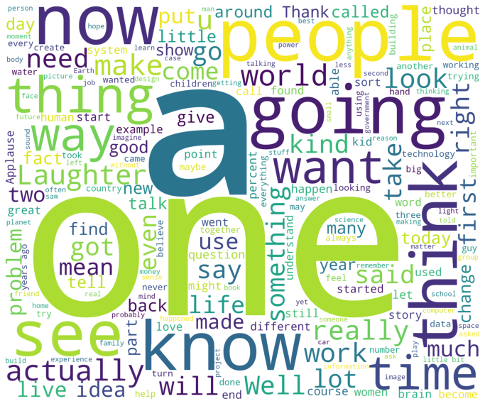
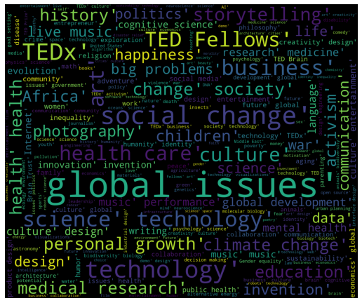
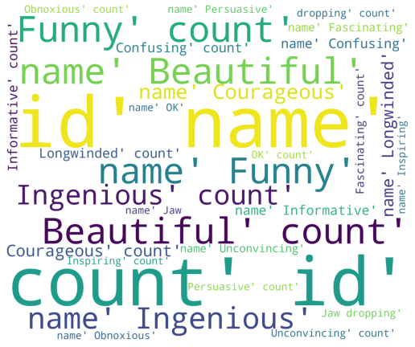
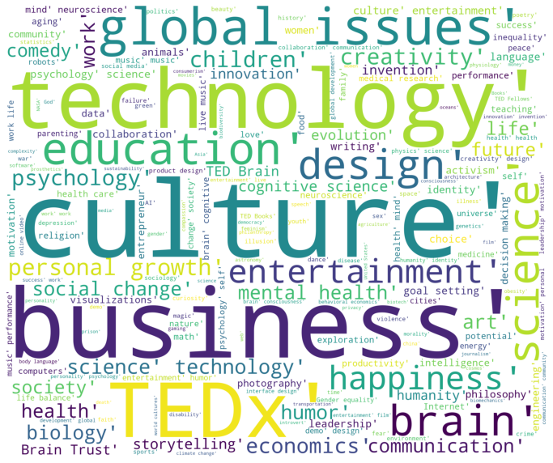

```python
import numpy as np
import pandas as pd
import datetime
import matplotlib.pyplot as plt

```


```python
ted=pd.read_excel('E:\\Desktop\\Ted-project\\0904_add_topic_2.xlsx',header=0)
ted.head()
```


<div>
<style scoped>
    .dataframe tbody tr th:only-of-type {
        vertical-align: middle;
    }

    .dataframe tbody tr th {
        vertical-align: top;
    }

    .dataframe thead th {
        text-align: right;
    }
</style>
<table border="1" class="dataframe">
  <thead>
    <tr style="text-align: right;">
      <th></th>
      <th>Unnamed: 0</th>
      <th>ID</th>
      <th>comments</th>
      <th>description</th>
      <th>duration</th>
      <th>event</th>
      <th>film_date</th>
      <th>film_date_after_conversion</th>
      <th>languages</th>
      <th>main_speaker</th>
      <th>...</th>
      <th>title</th>
      <th>url</th>
      <th>views</th>
      <th>transcripts.transcript</th>
      <th>like degree</th>
      <th>speaker_speech_times</th>
      <th>speech words</th>
      <th>high views</th>
      <th>top_topic</th>
      <th>topics_perDoc</th>
    </tr>
  </thead>
  <tbody>
    <tr>
      <th>0</th>
      <td>0</td>
      <td>1</td>
      <td>4553</td>
      <td>Sir Ken Robinson makes an entertaining and pro...</td>
      <td>1164</td>
      <td>TED2006</td>
      <td>1140825600</td>
      <td>2006/02/25</td>
      <td>60</td>
      <td>Ken Robinson</td>
      <td>...</td>
      <td>Do schools kill creativity?</td>
      <td>https://www.ted.com/talks/ken_robinson_says_sc...</td>
      <td>47227110</td>
      <td>Good morning. How are you?(Laughter)It's been ...</td>
      <td>0.963239</td>
      <td>3</td>
      <td>3938</td>
      <td>1</td>
      <td>1</td>
      <td>Life</td>
    </tr>
    <tr>
      <th>1</th>
      <td>1</td>
      <td>2</td>
      <td>265</td>
      <td>With the same humor and humanity he exuded in ...</td>
      <td>977</td>
      <td>TED2006</td>
      <td>1140825600</td>
      <td>2006/02/25</td>
      <td>43</td>
      <td>Al Gore</td>
      <td>...</td>
      <td>Averting the climate crisis</td>
      <td>https://www.ted.com/talks/al_gore_on_averting_...</td>
      <td>3200520</td>
      <td>Thank you so much, Chris. And it's truly a gre...</td>
      <td>0.546662</td>
      <td>4</td>
      <td>2556</td>
      <td>1</td>
      <td>1</td>
      <td>Life</td>
    </tr>
    <tr>
      <th>2</th>
      <td>2</td>
      <td>3</td>
      <td>124</td>
      <td>New York Times columnist David Pogue takes aim...</td>
      <td>1286</td>
      <td>TED2006</td>
      <td>1140739200</td>
      <td>2006/02/24</td>
      <td>26</td>
      <td>David Pogue</td>
      <td>...</td>
      <td>Simplicity sells</td>
      <td>https://www.ted.com/talks/david_pogue_says_sim...</td>
      <td>1636292</td>
      <td>(Music: "The Sound of Silence," Simon &amp; Garfun...</td>
      <td>0.699717</td>
      <td>4</td>
      <td>4262</td>
      <td>0</td>
      <td>1</td>
      <td>Life</td>
    </tr>
    <tr>
      <th>3</th>
      <td>3</td>
      <td>4</td>
      <td>200</td>
      <td>In an emotionally charged talk, MacArthur-winn...</td>
      <td>1116</td>
      <td>TED2006</td>
      <td>1140912000</td>
      <td>2006/02/26</td>
      <td>35</td>
      <td>Majora Carter</td>
      <td>...</td>
      <td>Greening the ghetto</td>
      <td>https://www.ted.com/talks/majora_carter_s_tale...</td>
      <td>1697550</td>
      <td>If you're here today ¡ª and I'm very happy tha...</td>
      <td>0.893509</td>
      <td>2</td>
      <td>3535</td>
      <td>0</td>
      <td>3</td>
      <td>Smart city</td>
    </tr>
    <tr>
      <th>4</th>
      <td>4</td>
      <td>5</td>
      <td>593</td>
      <td>You've never seen data presented like this. Wi...</td>
      <td>1190</td>
      <td>TED2006</td>
      <td>1140566400</td>
      <td>2006/02/22</td>
      <td>48</td>
      <td>Hans Rosling</td>
      <td>...</td>
      <td>The best stats you've ever seen</td>
      <td>https://www.ted.com/talks/hans_rosling_shows_t...</td>
      <td>12005869</td>
      <td>About 10 years ago, I took on the task to teac...</td>
      <td>0.966120</td>
      <td>9</td>
      <td>3715</td>
      <td>1</td>
      <td>4</td>
      <td>Politics</td>
    </tr>
  </tbody>
</table>
<p>5 rows × 28 columns</p>
</div>


```python
pip install wordcloud
```

    Looking in indexes: https://pypi.tuna.tsinghua.edu.cn/simple
    Collecting wordcloud
      Downloading https://pypi.tuna.tsinghua.edu.cn/packages/fc/7e/5848c211b1f141ffae41f0f05d72c0bfdb4816f9bf9d80f02962d019b8fe/wordcloud-1.8.1-cp38-cp38-win_amd64.whl (155 kB)
    Requirement already satisfied: matplotlib in e:\techsoftware\anaconda\lib\site-packages (from wordcloud) (3.3.4)
    Requirement already satisfied: pillow in e:\techsoftware\anaconda\lib\site-packages (from wordcloud) (8.2.0)
    Requirement already satisfied: numpy>=1.6.1 in e:\techsoftware\anaconda\lib\site-packages (from wordcloud) (1.20.1)
    Requirement already satisfied: python-dateutil>=2.1 in e:\techsoftware\anaconda\lib\site-packages (from matplotlib->wordcloud) (2.8.1)
    Requirement already satisfied: pyparsing!=2.0.4,!=2.1.2,!=2.1.6,>=2.0.3 in e:\techsoftware\anaconda\lib\site-packages (from matplotlib->wordcloud) (2.4.7)
    Requirement already satisfied: cycler>=0.10 in e:\techsoftware\anaconda\lib\site-packages (from matplotlib->wordcloud) (0.10.0)
    Requirement already satisfied: kiwisolver>=1.0.1 in e:\techsoftware\anaconda\lib\site-packages (from matplotlib->wordcloud) (1.3.1)
    Requirement already satisfied: six in e:\techsoftware\anaconda\lib\site-packages (from cycler>=0.10->matplotlib->wordcloud) (1.15.0)
    Installing collected packages: wordcloud
    Successfully installed wordcloud-1.8.1
    Note: you may need to restart the kernel to use updated packages.
    


```python
#生成新语言库
from wordcloud import WordCloud,STOPWORDS
corpus = ' '.join(ted['transcripts.transcript'].astype(str))#注意数据类型转换为字符串
corpus = corpus.replace('.', '. ')
wordcloud=WordCloud(stopwords=STOPWORDS,background_color='white',width=2400,height=2000).generate(corpus)
plt.figure(figsize=(12,15))
plt.imshow(wordcloud)
plt.axis('off')
plt.show()
```


    

    


```python
corpustag = ' '.join(ted['tags'].astype(str))#注意数据类型转换为字符串
corpustag = corpustag.replace('.', '. ')
wordcloud=WordCloud(stopwords=STOPWORDS,background_color='black',width=2400,height=2000).generate(corpustag)
plt.figure(figsize=(9,9))
plt.imshow(wordcloud)
plt.axis('off')
plt.show()
```


    

    


```python
corpusrating = ' '.join(ted['ratings'].astype(str))#注意数据类型转换为字符串
corpusrating = corpusrating.replace('.', '. ')
wordcloud=WordCloud(stopwords=STOPWORDS,background_color='black',width=2400,height=2000).generate(corpusrating)
plt.figure(figsize=(9,9))
plt.imshow(wordcloud)
plt.axis('off')
plt.show()
```


    

    


```python
ted.loc[ted['high views'] == 1]['tags']
```


<div>
<style scoped>
    .dataframe tbody tr th:only-of-type {
        vertical-align: middle;
    }

    .dataframe tbody tr th {
        vertical-align: top;
    }

    .dataframe thead th {
        text-align: right;
    }
</style>
<table border="1" class="dataframe">
  <thead>
    <tr style="text-align: right;">
      <th></th>
      <th>Unnamed: 0</th>
      <th>ID</th>
      <th>comments</th>
      <th>description</th>
      <th>duration</th>
      <th>event</th>
      <th>film_date</th>
      <th>film_date_after_conversion</th>
      <th>languages</th>
      <th>main_speaker</th>
      <th>...</th>
      <th>title</th>
      <th>url</th>
      <th>views</th>
      <th>transcripts.transcript</th>
      <th>like degree</th>
      <th>speaker_speech_times</th>
      <th>speech words</th>
      <th>high views</th>
      <th>top_topic</th>
      <th>topics_perDoc</th>
    </tr>
  </thead>
  <tbody>
    <tr>
      <th>0</th>
      <td>0</td>
      <td>1</td>
      <td>4553</td>
      <td>Sir Ken Robinson makes an entertaining and pro...</td>
      <td>1164</td>
      <td>TED2006</td>
      <td>1140825600</td>
      <td>2006/02/25</td>
      <td>60</td>
      <td>Ken Robinson</td>
      <td>...</td>
      <td>Do schools kill creativity?</td>
      <td>https://www.ted.com/talks/ken_robinson_says_sc...</td>
      <td>47227110</td>
      <td>Good morning. How are you?(Laughter)It's been ...</td>
      <td>0.963239</td>
      <td>3</td>
      <td>3938</td>
      <td>1</td>
      <td>1</td>
      <td>Life</td>
    </tr>
    <tr>
      <th>1</th>
      <td>1</td>
      <td>2</td>
      <td>265</td>
      <td>With the same humor and humanity he exuded in ...</td>
      <td>977</td>
      <td>TED2006</td>
      <td>1140825600</td>
      <td>2006/02/25</td>
      <td>43</td>
      <td>Al Gore</td>
      <td>...</td>
      <td>Averting the climate crisis</td>
      <td>https://www.ted.com/talks/al_gore_on_averting_...</td>
      <td>3200520</td>
      <td>Thank you so much, Chris. And it's truly a gre...</td>
      <td>0.546662</td>
      <td>4</td>
      <td>2556</td>
      <td>1</td>
      <td>1</td>
      <td>Life</td>
    </tr>
    <tr>
      <th>4</th>
      <td>4</td>
      <td>5</td>
      <td>593</td>
      <td>You've never seen data presented like this. Wi...</td>
      <td>1190</td>
      <td>TED2006</td>
      <td>1140566400</td>
      <td>2006/02/22</td>
      <td>48</td>
      <td>Hans Rosling</td>
      <td>...</td>
      <td>The best stats you've ever seen</td>
      <td>https://www.ted.com/talks/hans_rosling_shows_t...</td>
      <td>12005869</td>
      <td>About 10 years ago, I took on the task to teac...</td>
      <td>0.966120</td>
      <td>9</td>
      <td>3715</td>
      <td>1</td>
      <td>4</td>
      <td>Politics</td>
    </tr>
    <tr>
      <th>5</th>
      <td>5</td>
      <td>6</td>
      <td>672</td>
      <td>Tony Robbins discusses the "invisible forces" ...</td>
      <td>1305</td>
      <td>TED2006</td>
      <td>1138838400</td>
      <td>2006/02/02</td>
      <td>36</td>
      <td>Tony Robbins</td>
      <td>...</td>
      <td>Why we do what we do</td>
      <td>https://www.ted.com/talks/tony_robbins_asks_wh...</td>
      <td>20685401</td>
      <td>Thank you. I have to tell you I'm both challen...</td>
      <td>0.802227</td>
      <td>1</td>
      <td>5327</td>
      <td>1</td>
      <td>1</td>
      <td>Life</td>
    </tr>
    <tr>
      <th>6</th>
      <td>6</td>
      <td>7</td>
      <td>919</td>
      <td>When two young Mormon missionaries knock on Ju...</td>
      <td>992</td>
      <td>TED2006</td>
      <td>1140739200</td>
      <td>2006/02/24</td>
      <td>31</td>
      <td>Julia Sweeney</td>
      <td>...</td>
      <td>Letting go of God</td>
      <td>https://www.ted.com/talks/julia_sweeney_on_let...</td>
      <td>3769987</td>
      <td>On September 10, the morning of my seventh bir...</td>
      <td>0.688563</td>
      <td>2</td>
      <td>3725</td>
      <td>1</td>
      <td>1</td>
      <td>Life</td>
    </tr>
    <tr>
      <th>...</th>
      <td>...</td>
      <td>...</td>
      <td>...</td>
      <td>...</td>
      <td>...</td>
      <td>...</td>
      <td>...</td>
      <td>...</td>
      <td>...</td>
      <td>...</td>
      <td>...</td>
      <td>...</td>
      <td>...</td>
      <td>...</td>
      <td>...</td>
      <td>...</td>
      <td>...</td>
      <td>...</td>
      <td>...</td>
      <td>...</td>
      <td>...</td>
    </tr>
    <tr>
      <th>2440</th>
      <td>2440</td>
      <td>2441</td>
      <td>283</td>
      <td>In 1993, Bill and Melinda Gates took a walk on...</td>
      <td>1500</td>
      <td>TED2014</td>
      <td>1395100800</td>
      <td>2014/03/18</td>
      <td>28</td>
      <td>Bill and Melinda Gates</td>
      <td>...</td>
      <td>Why giving away our wealth has been the most s...</td>
      <td>https://www.ted.com/talks/bill_and_melinda_gat...</td>
      <td>3130752</td>
      <td>Chris Anderson: So, this is an interview with ...</td>
      <td>0.913146</td>
      <td>1</td>
      <td>5307</td>
      <td>1</td>
      <td>1</td>
      <td>Life</td>
    </tr>
    <tr>
      <th>2441</th>
      <td>2441</td>
      <td>2442</td>
      <td>177</td>
      <td>How much do you know about the world? Hans Ros...</td>
      <td>1145</td>
      <td>TEDSalon Berlin 2014</td>
      <td>1403481600</td>
      <td>2014/06/23</td>
      <td>32</td>
      <td>Hans and Ola Rosling</td>
      <td>...</td>
      <td>How not to be ignorant about the world</td>
      <td>https://www.ted.com/talks/hans_and_ola_rosling...</td>
      <td>3673455</td>
      <td>Hans Rosling: I'm going to ask you three multi...</td>
      <td>0.876845</td>
      <td>1</td>
      <td>3409</td>
      <td>1</td>
      <td>5</td>
      <td>Human</td>
    </tr>
    <tr>
      <th>2445</th>
      <td>2445</td>
      <td>2446</td>
      <td>52</td>
      <td>Legendary duo Jane Fonda and Lily Tomlin have ...</td>
      <td>944</td>
      <td>TEDWomen 2015</td>
      <td>1432684800</td>
      <td>2015/05/27</td>
      <td>29</td>
      <td>Jane Fonda and Lily Tomlin</td>
      <td>...</td>
      <td>A hilarious celebration of lifelong female fri...</td>
      <td>https://www.ted.com/talks/jane_fonda_and_lily_...</td>
      <td>2269844</td>
      <td>Pat Mitchell: So I was thinking about female f...</td>
      <td>0.854357</td>
      <td>1</td>
      <td>3040</td>
      <td>1</td>
      <td>8</td>
      <td>Love story</td>
    </tr>
    <tr>
      <th>2446</th>
      <td>2446</td>
      <td>2447</td>
      <td>36</td>
      <td>Before he fought in the galactic battles of St...</td>
      <td>1082</td>
      <td>TED Talks Live</td>
      <td>1446508800</td>
      <td>2015/11/03</td>
      <td>24</td>
      <td>Adam Driver</td>
      <td>...</td>
      <td>My journey from Marine to actor</td>
      <td>https://www.ted.com/talks/adam_driver_my_journ...</td>
      <td>3016666</td>
      <td>I was a Marine with 1/1 Weapons Company, 81's ...</td>
      <td>0.900457</td>
      <td>1</td>
      <td>3950</td>
      <td>1</td>
      <td>1</td>
      <td>Life</td>
    </tr>
    <tr>
      <th>2455</th>
      <td>2455</td>
      <td>2456</td>
      <td>308</td>
      <td>In 1996, Thordis Elva shared a teenage romance...</td>
      <td>1146</td>
      <td>TEDWomen 2016</td>
      <td>1477440000</td>
      <td>2016/10/26</td>
      <td>21</td>
      <td>Thordis Elva and Tom Stranger</td>
      <td>...</td>
      <td>Our story of rape and reconciliation</td>
      <td>https://www.ted.com/talks/thordis_elva_tom_str...</td>
      <td>3950921</td>
      <td>[This talk contains graphic language and descr...</td>
      <td>0.844506</td>
      <td>1</td>
      <td>3048</td>
      <td>1</td>
      <td>8</td>
      <td>Love story</td>
    </tr>
  </tbody>
</table>
<p>493 rows × 28 columns</p>
</div>


```python
ted.loc[ted['high views'] == 1]['tags']
```


    0       ['children', 'creativity', 'culture', 'dance',...
    1       ['alternative energy', 'cars', 'climate change...
    4       ['Africa', 'Asia', 'Google', 'demo', 'economic...
    5       ['business', 'culture', 'entertainment', 'goal...
    6       ['Christianity', 'God', 'atheism', 'comedy', '...
                                  ...                        
    2440    ['activism', 'business', 'money', 'philanthropy']
    2441            ['global issues', 'health', 'statistics']
    2445    ['Gender equality', 'aging', 'comedy', 'friend...
    2446    ['collaboration', 'communication', 'entertainm...
    2455    ['activism', 'collaboration', 'communication',...
    Name: tags, Length: 493, dtype: object


```python
corpustagHigh = ' '.join(ted.loc[ted['high views'] == 1]['tags'].astype(str))#注意数据类型转换为字符串
corpustagHigh = corpustagHigh.replace('.', '. ')
wordcloud=WordCloud(stopwords=STOPWORDS,background_color='white',width=2400,height=2000).generate(corpustagHigh)
plt.figure(figsize=(12,15))
plt.imshow(wordcloud)
plt.axis('off')
plt.show()
```


    

    


```python

```


```python

```
